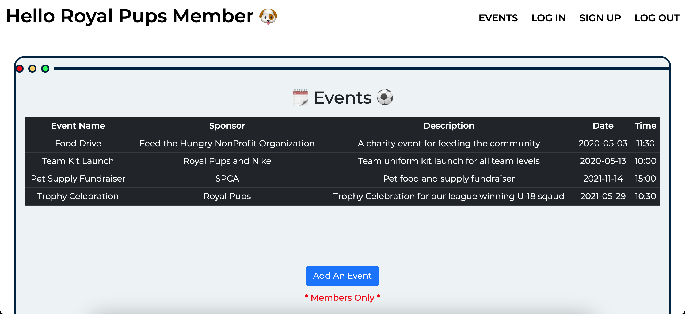

# PHP login and Registration Forms

        

A login and signup form built with PHP, HTML, CSS, Bootstrap 5 and SQLite. This project contains two data entry forms, one for registrations and one for events. Only users who are logged in are able to add events. The data that is entered into both forms are saved to a database (SQLite). 

Passowrds are hashed using php. After a successful login, registration, or logout, the user is sent a session meesage to their screen using PHP and Bootstrap 5. 
These pages also look in the session for messages, and, if found, displays them at the top of the page, above the form, and delete them from the session when done. 

    The website was deployed on a server cloud (Heroku & CS Department linux servers).

## 2 Features
- Sign up for an account (informations saved to database)
- Log in 
- Event calender
- Add an event (users ONLY)
- Stores passwords in DB as hashes
- Easy logout via logout.php
- Check session for messages regarding logged in/out status

## 3 Technologies used
- PHP
- HTML
- CSS
- Boostrap 5
- SQLite for database 

## 4 Files
- index.php
> This is the homepage. Thee user can login through this page. After successful login, the user is sent an message to alert the user.

- login_action.php

- logout_action.php
> The user's session information (id/username) and message is cleared

- header.php
> This file contains the left and right menu. The left menu shows if the user is logged in.  The message "Hello Guest" or "Hello Royal Pups Member" is displayed depending on the user's session information. 

- registration.php
> This is the sign upn form where the user can register for an account. 

- registration_action.php
> When the user submits the registration form, the information is saved to the database.

- events.php
> This page contains chronological list of events sponsored by the organization. Everyone is able to view the calender but only users are able to add events.

- new_event.php
- new_event_action.php

## 5 Screenshots
>Registration/Sign up

>Home/Sign In 

>User logged in

>Events

